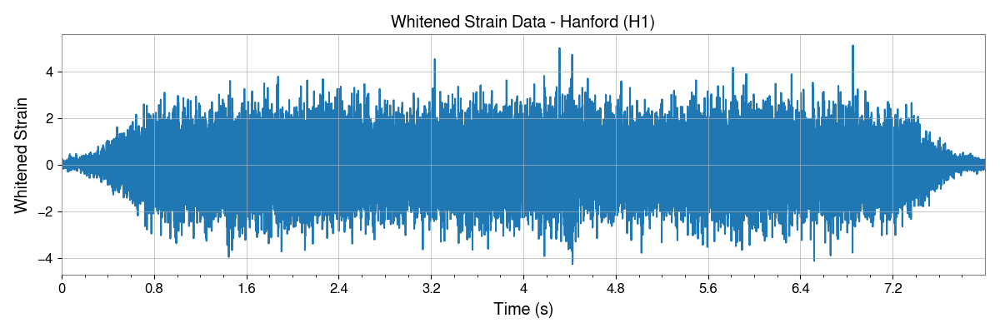
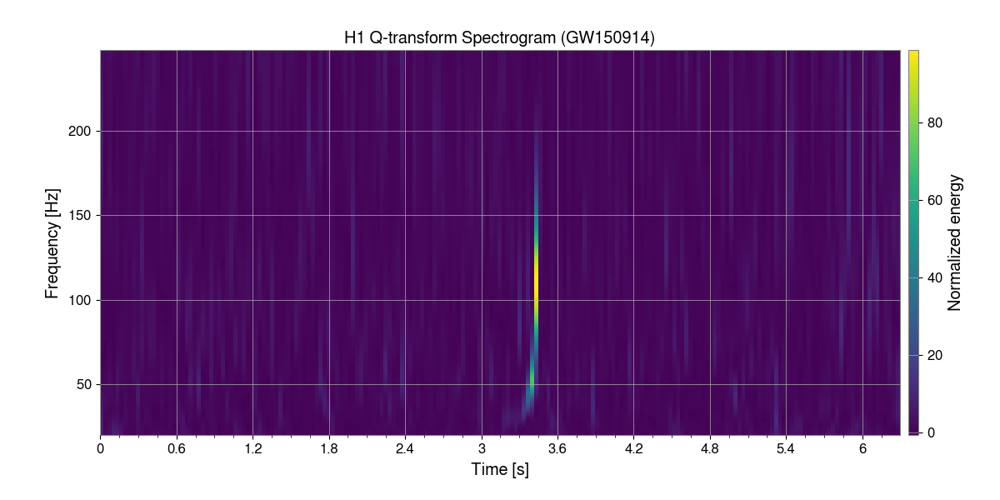

# GravAgents

  

*An AI agent based analysis tool for gravitational waves analysis.*

---

## 🚀 What Is This?

GravAgents multi agent system fro analyzing gravitaional wave signal and estimate key parameters (mass, angular frequency, ..) of the signal source from a natural language query.

---

## 🧪 The agentic setup

  

The image above show the how different agents are intertwined and how the query is porcessed by them to produce results.
---

## 📸 Some example query and results

Query 1: Download the strain data for GW150914 event and plot the strain vs time plot.


Result : 


Query 2: Download the strain data for GW150914 event using  TimeSeries.fetch_open_data(). Then whiten the data. Then plot the strain vs time graph of this whitened data.


Result : 


Query 3: Download the  H1 and L1  strain data for GW150914 using TimeSeries.fetch_open_data() . Then whiten the data, then do a lowpass filter at 250hz and high pass filter at 30 hz and then plot it. PLot both of the strain data on the same graph


Result : 


Query 4: Download the strain data for GW150914 event using TimeSeries.fetch_open_data() from both H1 and L1 detector. Then plot the q_transform spectroscopy plot fro both of them. make sure there is normalised energy bar in the plot.


Result: 



Query 5: Download the H1 strain data for GW150914 using TimeSeries.fetch_open_data() over a 12-second window centered on the merger (~8 s before, 4 s after). Whiten the data and apply a bandpass filter between 30–250 Hz. Ensure that both detectors have consistent sample rates and lengths, resampling or trimming as necessary.Generate PyCBC waveform templates for component masses 10–30 M☉, zero spins, and specify a valid approximant (e.g., "SEOBNRv4_opt" or "IMRPhenomD") to avoid NoneType errors. Keep only templates longer than 0.2 s, and pad or truncate them to match the data length. Convert both the strain data and templates to PyCBC TimeSeries with identical delta_t.Important: Before plotting, scale each template so that its maximum absolute amplitude matches the maximum absolute amplitude of the processed H1 strain. This ensures that the template is clearly visible when overlaid on the detector signal.For each template, create a separate plot overlaying the scaled template on top of the H1 strain signal, so the alignment is clearly visible. Additionally, produce a plot showing the combined H1 strain data for reference.Save all individual template overlay plots, the combined H1 strain plot, and the template arrays to disk for later analysis. Skip PSD estimation and matched filtering for now, but ensure all valid templates are included in the overlay plots.


Result:  


---

## 💻 Getting Started

### Prerequisites

Make sure you have:

- Python 3.8+  
- `numpy`, `matplotlib`, `scipy` (or other dependencies you use)  

You can install dependencies via:

```bash
pip install -r requirements.txt
